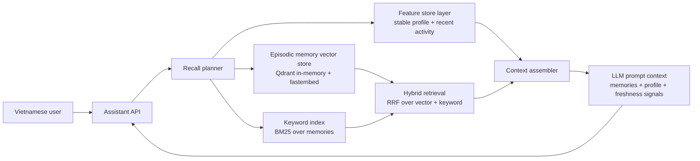

# Bonus Architecture - Hybrid Memory for a Vietnamese-first Assistant

Contributors: Thanh Danh + Codex

## Overview

This POC designs a personal AI assistant memory layer for Vietnamese users. It separates memory into three stores because each kind of memory changes at a different speed and is queried in a different way: episodic memories need semantic retrieval, stable profile features need consistent low-latency lookup, and recent activity needs fresh counters that can change within minutes.

The demo uses Qdrant in-memory, fastembed, BM25, and an in-process feature-store-like layer. In production I would keep the same boundary but replace the profile layer with Feast online store and a streaming feature view for recent activity.

## Decision 1: Chunking Strategy

I chunk episodic memory as short semantic events: one note, one user-saved passage, or one conversation turn summary. This is smaller than a full conversation but larger than a single sentence. The tradeoff is retrieval quality versus storage cost and context pressure. Per-message chunks are cheap to create and precise, but Vietnamese conversations often rely on context from the previous turn, so a single message can be ambiguous. Whole-conversation chunks preserve context but waste the LLM context window and make retrieval noisy when only one topic inside the conversation matters. Semantic event chunks are a middle path: they keep enough local context, fit naturally into top-k retrieval, and can later be consolidated into weekly summaries.

For Vietnamese, I would store both raw text and normalized text. The raw text is needed for faithful recall. The normalized text can lowercase, remove repeated punctuation, and optionally apply a Vietnamese tokenizer such as underthesea or pyvi. For this POC, BM25 uses whitespace split because it is transparent and dependency-light; vector search absorbs some tokenizer weakness. In production, I would evaluate tokenizer choice on code-switched vi/en queries and phonetic typos.

## Decision 2: Feature Schema

The feature schema has one entity, `user_id`, and two groups. Stable profile features include `preferred_language`, `reading_speed_wpm`, `topic_affinity`, and `active_hours`. Recent activity features include `queries_last_hour`, `recent_topics`, and `last_activity_minutes`. Stable profile TTL should be days or weeks because it changes slowly. Recent activity TTL should be one hour because stale activity is actively harmful: recommending "take a break" or "continue cloud security" from yesterday's signals would feel wrong.

I chose tabular features rather than embedding features for the profile. Tabular features are inspectable, easy to debug, and map directly to Feast feature views and point-in-time joins. Embedding features for user preference are attractive because they can capture latent tastes, but they are harder to explain and harder to keep fresh without re-embedding history. A future version could add a user-preference embedding as a separate feature, but I would not make it the only profile representation.

## Decision 3: Freshness Strategy

Different use cases need different freshness. First, `remember()` for a newly saved note should be visible in recall immediately, ideally sub-second, because the user expects "I just told you this" to work right away. Second, recent activity counters such as `queries_last_hour` can refresh every minute or via streaming updates; they personalize "what am I focused on lately?" and fatigue detection. Third, stable profile features such as reading speed and long-term topic affinity can refresh daily or after a batch job, because over-updating them from one noisy session can cause personalization drift.

This connects to the lab concepts: episodic memory is vector retrieval, hybrid retrieval uses RRF to combine BM25 and semantic similarity, stable features use a Feature Store-like online lookup, and historical training should use point-in-time joins so future user behavior does not leak into past recommendation labels.

## Rejected Alternative

I considered storing episodic memories as an embedding feature view inside the feature store, but rejected it. Feature stores are excellent for keyed tabular values with TTL and PIT correctness. Vector memory needs nearest-neighbor search, metadata filtering by user, chunk deletion, and re-indexing behavior. Those lifecycle needs are different from profile features. Splitting Vector Store and Feature Store keeps each tool doing its strongest job.

## What This POC Does Not Handle Yet

This POC does not implement encryption, multi-device sync, deletion requests, or strict privacy isolation beyond filtering by `user_id`. A production Vietnamese assistant should consider personal data protection requirements, including consent, retention, export/delete flows, and tenant isolation. It also does not perform LLM summarization or memory consolidation; repeated similar memories will remain separate until a future consolidation job merges them.
